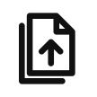

<div align="center">
  <h1>SpareNotes</h1>
  <p><strong>Automatic, one-way Supernote backups to Proton Drive.</strong></p>
  
  <p>
    <a href="https://github.com/m4nespin/sparenotes/releases/latest"></a>
    <a href="https://github.com/m4nespin/sparenotes/actions/workflows/ci.yml"></a>
    <a href="./LICENSE"></a>
  </p>
  <p>
    <a href="#download-and-install">Download</a> ·
    <a href="#what-it-does">Features</a> ·
    <a href="#nomad-setup">Setup</a> ·
    <a href="#security-model">Security</a> ·
    <a href="#build-from-source">Build</a>
  </p>
</div>

SpareNotes is a small, native Android app for automatic backup from selected Supernote Nomad folders to Proton Drive.

## Download and install

SpareNotes currently supports the Supernote Nomad's ARM64 Android 11 environment.

1. Download the latest `SpareNotes-v*.apk` and matching `.sha256` file from [GitHub Releases](https://github.com/m4nespin/sparenotes/releases).
2. Verify the APK hash against the first value in the `.sha256` file:

   ```powershell
   Get-FileHash .\SpareNotes-v*.apk -Algorithm SHA256
   ```

3. On the Nomad, enable **Settings → Security & Privacy → Sideloading**.
4. Install the verified APK.

Only install APKs attached to this repository's releases. Source archives are not installable apps.

## What it does

- Lets you select exact internal-storage or microSD folders with Android's folder picker.
- Recursively includes every file below each selected folder.
- Runs only on Wi-Fi. Android schedules a run when Wi-Fi reconnects and once a day while it stays connected; **Back up now** starts a foreground backup immediately.
- Uploads new files and replaces changed cloud copies under `/my-files/SpareNotes`.
- Never deletes a local file or a Proton Drive file. Removing a source or deleting a local file leaves its existing cloud copy untouched.
- Stores a SHA-256 content fingerprint after each bounded upload batch for fast local checks. If that local history is lost, Proton's content digest still skips unchanged remote files.

Android jobs are intentionally inexact and may be deferred while the Nomad sleeps. Active backups use a foreground service and wake lock so large transfers can finish after the screen sleeps. Android can miss a Wi-Fi disconnect while SpareNotes' process is stopped; the daily job remains the fallback.

## Nomad setup

1. Open SpareNotes and tap **Connect Proton Drive**.
2. Scan the one-time QR with a phone, sign in directly on Proton's page, and approve access.
3. Tap **Add folder**, choose `disk` for the microSD card, open the desired folder, then tap **Use this folder**. Repeat for more folders.

The official Proton Drive Android app is not required by SpareNotes.

## Security model

- SpareNotes never receives or stores the Proton password. Authentication happens on Proton's HTTPS page.
- It uses Proton's official Drive CLI/SDK for authentication, encryption, and uploads.
- The CLI session is encrypted at rest with an Android Keystore AES-256-GCM key. Plaintext exists only in SpareNotes' private app directory while a Proton command is active.
- Android backups are disabled and cleartext network traffic is blocked.
- A tiny compatibility wrapper converts syscalls rejected by Android's app sandbox to `ENOSYS`; it does not grant or bypass Android permissions.
- The bundled CLI has one source-level byte patch: its desktop-only `xdg-open` call returns immediately because SpareNotes itself renders the one-time URL and QR. See `tools/patch-proton-cli.ps1`.

## Build from source

Requirements: JDK 17+, Android SDK 36, and Android NDK 27 only when rebuilding the compatibility wrapper.

The first build downloads Proton Drive CLI 0.8.0 from Proton, verifies its official SHA-512 checksum, applies the Android browser-launch patch, and verifies the patched SHA-256 checksum. The 110 MB generated binary is intentionally excluded from Git.

```powershell
.\gradlew.bat lintDebug testDebugUnitTest assembleDebug
```

The debug APK is for development only. It is debuggable and must not be installed on a device holding Proton data.

Create the release signing key once, then back up `.release-signing` somewhere secure. Losing this key prevents future in-place updates.

```powershell
.\tools\setup-release-key.ps1
.\gradlew.bat assembleRelease
```

Install only the resulting signed, non-debuggable release APK.

To rebuild the ARM64 compatibility wrapper with NDK 27:

```powershell
& "$env:LOCALAPPDATA\Android\Sdk\ndk\27.0.12077973\toolchains\llvm\prebuilt\windows-x86_64\bin\aarch64-linux-android30-clang.cmd" `
  -O2 -fPIE -pie app\src\main\cpp\compatwrap.c `
  -o app\src\main\jniLibs\arm64-v8a\libcompatwrap.so
```

GitHub Actions runs lint, unit tests, and a debug build for every pull request and every push to `main`.

See [RELEASING.md](RELEASING.md) for signing and publishing steps.

## Bundled runtime

The app bundles Proton Drive CLI 0.8.0, a patched musl loader/runtime, GCC runtime libraries, Alpine's CA bundle, and ZXing QR support. Exact provenance and licenses are recorded in [THIRD_PARTY_NOTICES.md](THIRD_PARTY_NOTICES.md).
